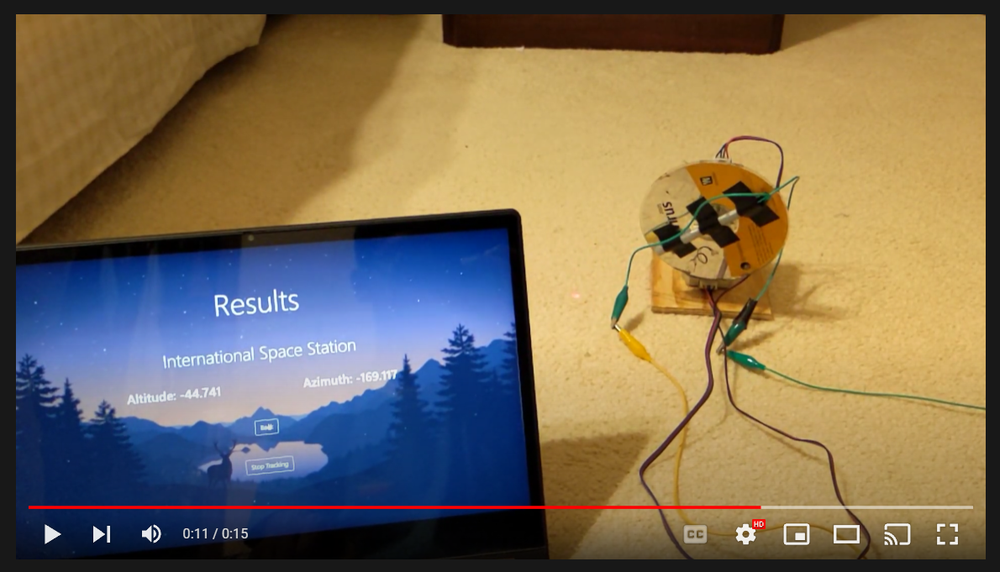
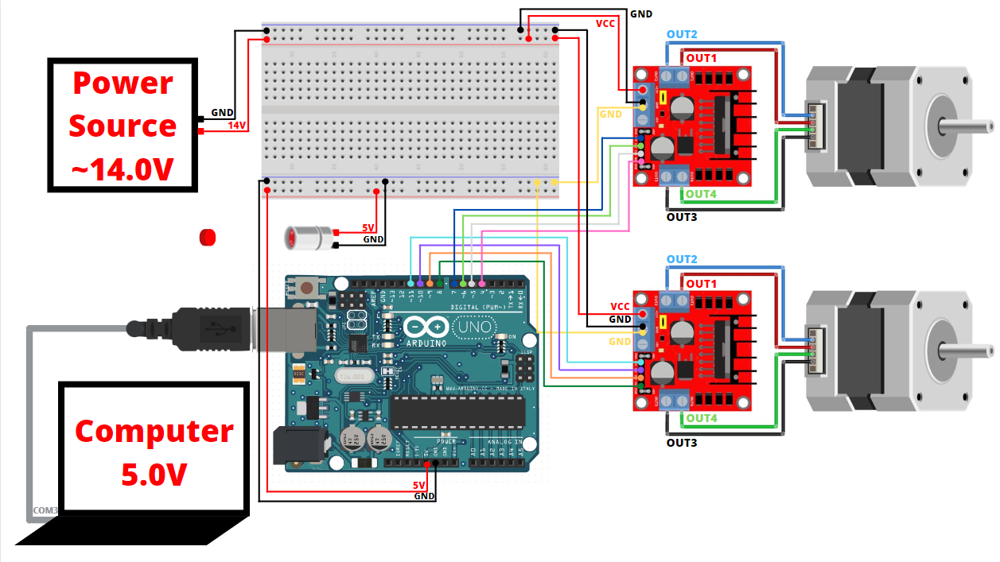
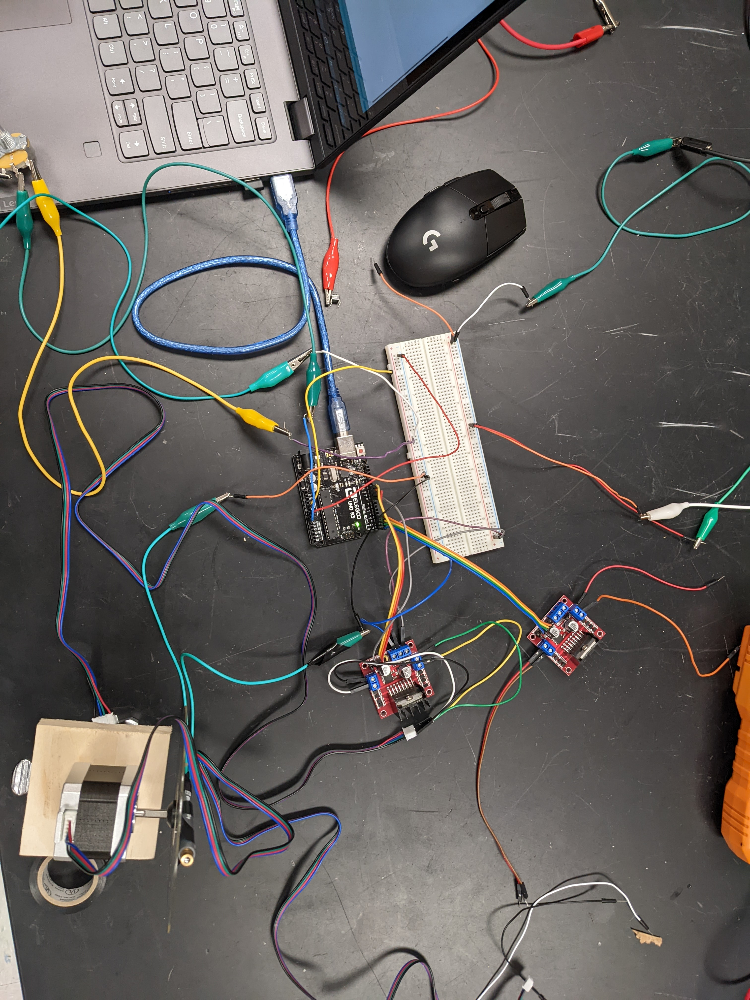

<p>
    <a href="https://www.arduino.cc/" alt="Arduino">
        
    </a>
    <a href="https://opensource.org/licenses/MIT" alt="MIT License">
        
    </a>
    <a href="https://github.com/J-Rishabh/Arduino/tree/master/AstroPointer" alt="Github Repository">
        
    </a>
</p>

# AstroPointer
> The auto-guided laser pointer for astronomical objects using Arduino

## About 
For my AP Physics C final project, I created a laser pointer that will auto-track to the given astronomical object. The laser diode is mounted to two stepper motors to give control over altitude and azimuth. Details about the hardware setup and libraries involved are below.
Here is the [Github Repository](https://github.com/J-Rishabh/Arduino/tree/master/MapMaker) including code, videos, and pictures. 
Here is a demo [video](https://youtu.be/aVy9g_HJ3FI)!

## Installation
Use [git](https://git-scm.com/) to install all related files.
```sh
git clone https://github.com/J-Rishabh/Arduino.git
```

Take the folder that you need from the repository.


## Demo
[](https://youtu.be/aVy9g_HJ3FI "AstroPointer Demo")


## Schematic


## Hardware
 - Arduino Uno
 - 2x NEMA-17 Stepper Motors
 - 2x L298N DC Motor Driver Modules
 - Laser Diode (CD & Mousetrap Car Wheel Spacer)
 - External 14V power source
 - Breadboard
 - Jumper Wires
 - Hot Glue
 - D-Ring adjustable with screw
 - Wood for mounting


## Software Built With
 - Arduino IDE
    - AccelStepper.h library
 - Python
    - Flask
    - AstroPy
    - GeoPy
    - Pycraf
    - Serialcontrol
 - HTML/CSS
 - Editor of your choice (Visual Studio Code)

### Code
 - [Arduino Code](https://github.com/J-Rishabh/Arduino/blob/master/AstroPointer/AstroPointerArduino.ino) (based on https://forum.arduino.cc/t/serial-input-basics-updated/382007/3)
 - [Application](https://github.com/J-Rishabh/Arduino/blob/master/AstroPointer/Application.py)
 - [SerialControl](https://github.com/J-Rishabh/Arduino/blob/master/AstroPointer/serialcontrol.py)

## Assembly



## Usage
Once all the hardware is configured and the software installed, to run the code, simply upload the code to the arduino, and then launch application.py. You have to calibrate the laser pointer with true North and 0 degrees elevation. Once the flask application is opened, you can input your current location and the astronomical object which you wish to see. Then the motors should swivel and point to where it is. Refreshing will cause it to update and move the motors accordingly as it will remember its last known location. 


### License
[MIT License](https://choosealicense.com/licenses/mit/)