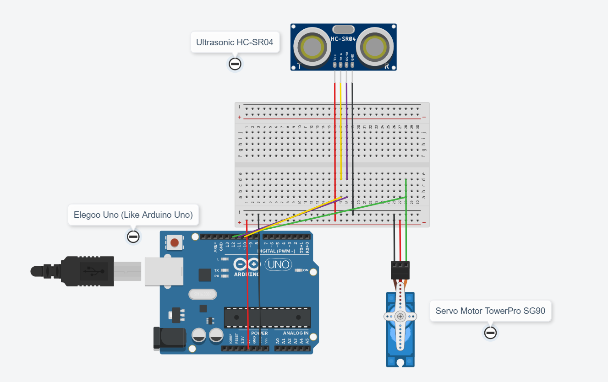
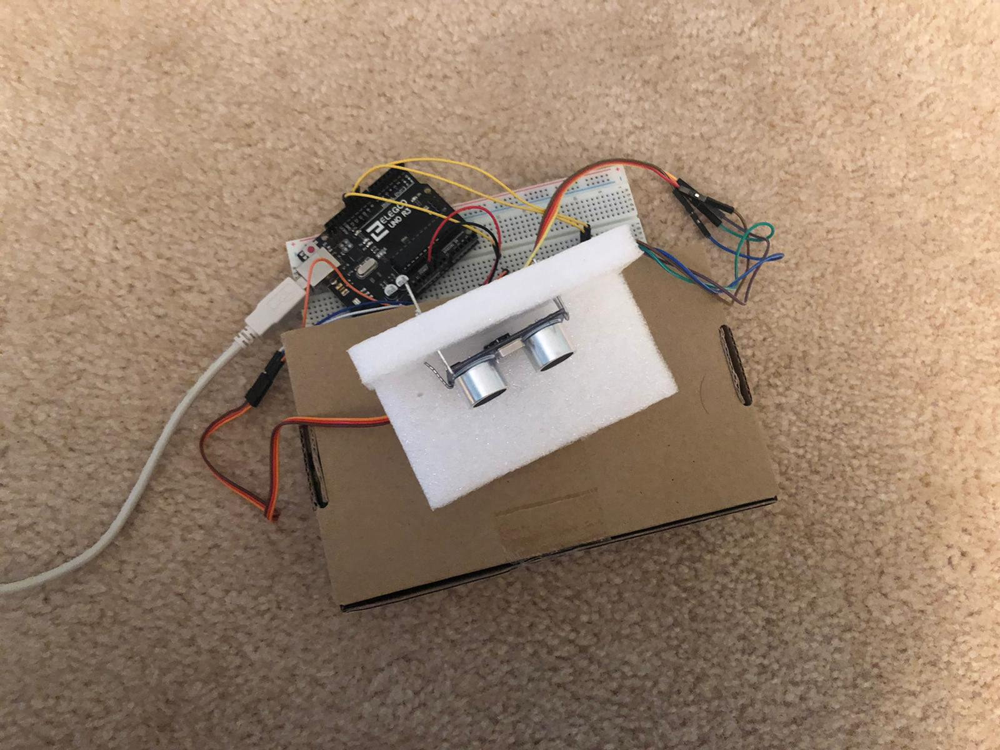
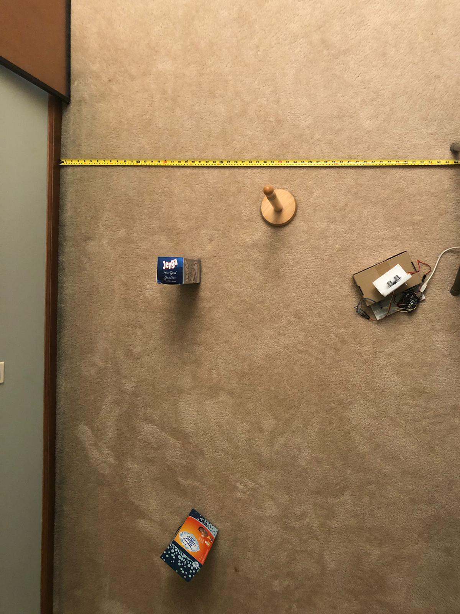
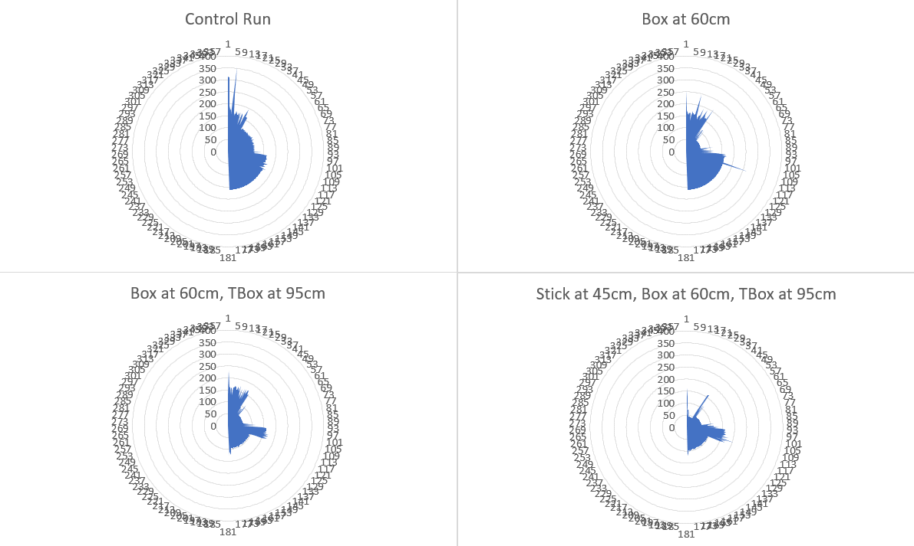
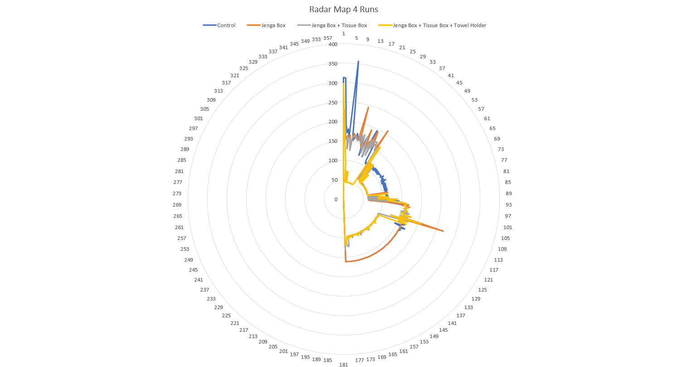

<p>
    <a href="https://www.arduino.cc/" alt="Arduino">
        
    </a>
    <a href="https://opensource.org/licenses/MIT" alt="MIT License">
        
    </a>
    <a href="https://github.com/J-Rishabh/Arduino/tree/master/MapMaker" alt="Github Repository">
        
    </a>
</p>

# Map Maker
> The Sonar Scanner & Map Maker using Arduino

## About 
For my CS50 Final Project, I worked on a hardware project involving arduino. This project is intended to use an ultrasonic sensor upon a stationary servo motor to provide a map of the surroundings. This is similar to Lidar's approach of using lasers. Here is the [Github Repository](https://github.com/J-Rishabh/Arduino/tree/master/MapMaker) including results, graphs, pictures, and code. Along with that, here is a demonstration [video](https://youtu.be/1dxt9DKOpEE)!

## Installation
Use [git](https://git-scm.com/) to install all related files.
```sh
git clone https://github.com/J-Rishabh/Arduino.git
```

Take the folder that you need from the repository.

## Hardware
 - Arduino Uno
 - Ultrasonic Sensor HC-SR04
 - Servo Motor TowerPro SG90
 - Breadboard
 - Jumper Wires

## Schematic


## Software Built With
 - Arduino IDE
    - Servo.h library
 - Editor of your choice (Visual Studio Code)
 - Excel/Google Sheets

### Code
 - [Link to Code](https://github.com/J-Rishabh/Arduino/blob/master/MapMaker/MapMaker.ino)

## Assembly



## Usage
Once all the hardware is configured and the software installed, to run the code, simply upload the code to the arduino, let it run, and open the serial monitor to see the data as it goes. To save the data, you can use a Python script or PuTTY to export it OR just copy and paste it into a txt/csv file. To see visual results, you can graph in an application like Excel or Google Sheets using a Radar graph.

# Results
To see the full raw data, check out [DataResults.xlsx](https://github.com/J-Rishabh/Arduino/blob/master/MapMaker/DataResults.xlsx)





### License
[MIT License](https://choosealicense.com/licenses/mit/)